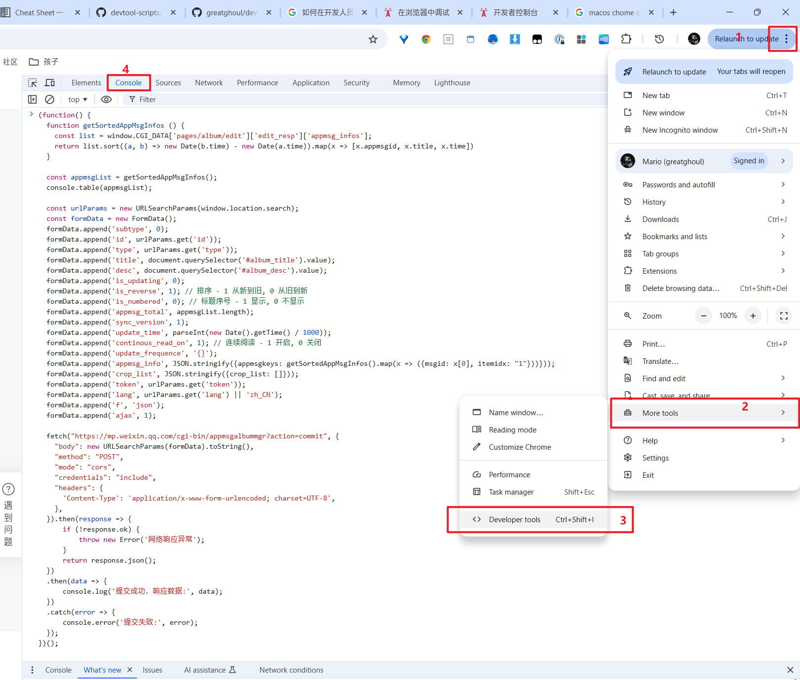
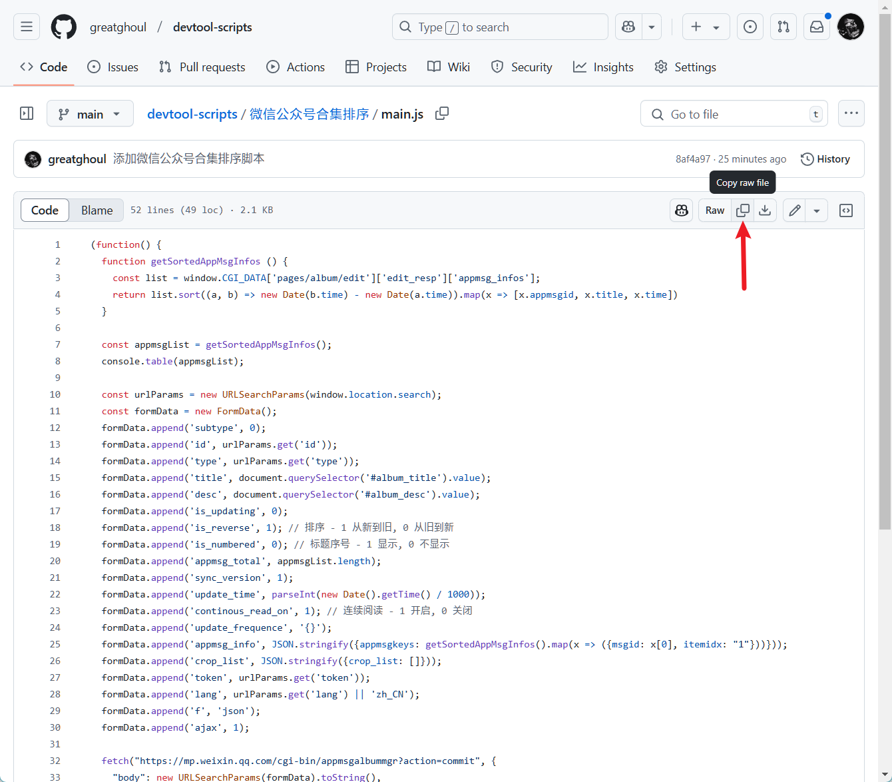

有时想改进一个网站的一个小功能，但是又不值得单独开发一个扩展，那么在开发人员工具中运行脚本就是一个很好的选择，用完即走，没有任何依赖，干净又卫生。

## 脚本

- [微信公众号合集排序](微信公众号合集排序) - 微信公众号合集快速按照文章发布日期排序

## FAQ

### 如何在开发人员工具中运行代码？

理论上，所有现代浏览器都是支持的，这里仅以 Google Chrome 为例。

#### 1 打开开发人员工具

在要执行的页面上按 `F12` 或者 `Ctrl+Shift+I` (macOS 是 `Option+⌘+I`) 即可打开开发者工具，如果默认不是 Console 标签页，就手动切换一下。

或者通过浏览器菜单打开。

#### 2 粘贴代码

在脚本目录中的 `main.js` 中复制代码，粘贴到控制台中，按照自己的需要修改代码后，按回车键运行即可。

### 开源协议？

本项目使用 [MIT 协议](./LICENSE) 开源，欢迎衍生修改，随意使用。
