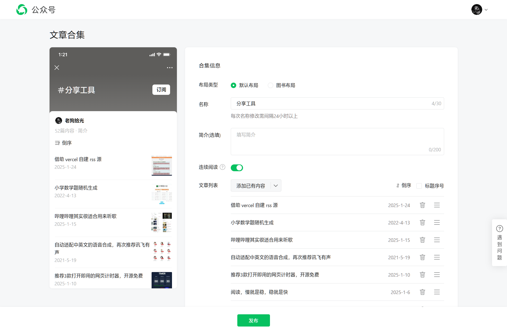

## 微信公众号合集排序脚本

微信公众号合集模式是按添加顺序升序或者降序的，但很多时候，我们想按照文章发布时间排序，就很痛苦，尤其是当文章多起来的时候，公众号网页的拖拽排序就非常难用了。



于是做了这么个脚本，用于快速按照发布时间升序或者降序排列。

> [!NOTE]
> 因为个人技术限制，无法解析到公众号中一些表单元素的值，脚本中的一些选项，需要大家手动修改，具体参考 [main.js](main.js)
> 
> ```js
> formData.append('is_reverse', 1); // 排序 - 1 从新到旧, 0 从旧到新
> formData.append('is_numbered', 0); // 标题序号 - 1 显示, 0 不显示
> formData.append('continous_read_on', 1); // 连续阅读 - 1 开启, 0 关闭
> ```

**脚本运行方式请参考**

[如何在开发人员工具中运行代码？](https://github.com/greatghoul/devtool-scripts?tab=readme-ov-file#%E5%A6%82%E4%BD%95%E5%9C%A8%E5%BC%80%E5%8F%91%E4%BA%BA%E5%91%98%E5%B7%A5%E5%85%B7%E4%B8%AD%E8%BF%90%E8%A1%8C%E4%BB%A3%E7%A0%81)

----

**欢迎关注我的公众号**


